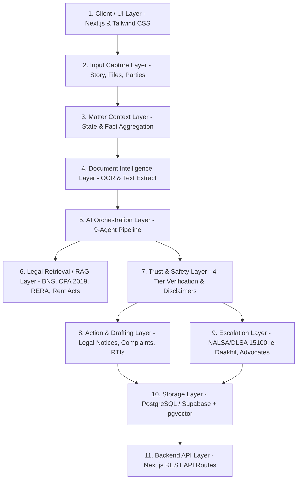

# ⚖️ NyaySaathi (न्यायसाथी)
### Matter-Based Legal Action Navigator for India

[](https://nextjs.org/)
[](https://www.typescriptlang.org/)
[](https://tailwindcss.com/)
[](https://www.postgresql.org/)
[](LICENSE)

> **NyaySaathi is not an AI legal chatbot.**  
> It is an actionable, matter-centric legal navigation system designed for Indian citizens, tenants, consumers, and small enterprises. It organizes disputes, extracts evidence, assesses limitation periods, generates formal Indian legal notices, and provides direct escalation pathways to **NALSA free legal aid**, **e-Daakhil**, and **RERA**.

---

## 🧭 The 5-Stage Navigator Loop

Unlike transient chatbots that lose context and produce hallucinated certainty, NyaySaathi operates on a structured loop:

```
┌─────────────┐    ┌───────────────┐    ┌──────────────┐    ┌─────────────┐    ┌──────────────┐
│ 1. CAPTURE  │ ─> │ 2. UNDERSTAND │ ─> │  3. ASSESS   │ ─> │   4. ACT    │ ─> │ 5. ESCALATE  │
└─────────────┘    └───────────────┘    └──────────────┘    └─────────────┘    └──────────────┘
  Story, Files,      Chronology, OCR,     Risks, Gaps,        Notices, RTIs,     DLSA/NALSA,
  Parties, Stake     Verified Facts       Limitation Clock    Complaints, Plan   e-Daakhil, Bar
```

---

## 🏛️ 11-Layer System Architecture



---

## 🤖 9 Internal Modular AI Agents

All AI logic is partitioned into modular, testable internal agents coordinated by a master orchestrator (`src/lib/agents/orchestrator.ts`) executing as an explicit Directed Acyclic Graph (DAG) with concurrency and matter cost budgets:

1. **Intake Agent** (`intake-agent.ts`): Parses freeform narratives, normalizes party details, and identifies legal conflict classification.
2. **Document Intelligence Agent** (`doc-intel-agent.ts`): Truthful text extraction; classifies agreements and receipts, flags images without OCR as `needs_ocr`, and guarantees zero hallucinated text.
3. **Context & Timeline Agent** (`timeline-agent.ts`): Reconstructs a strict chronological milestone trail and spots missing documentary dates.
4. **Legal Retrieval Agent** (`retrieval-agent.ts`): Maps disputes to Indian statutory anchors (Bharatiya Nyaya Sanhita - BNS, Consumer Protection Act 2019, RERA Section 18, State Rent Control Acts / Model Tenancy Act where adopted, NI Act 138, Payment of Wages Act).
5. **Reasoning Agent** (`reasoning-agent.ts`): Synthesizes case strengths, evidentiary vulnerabilities, and anticipated counter-arguments.
6. **Risk Assessment Agent** (`risk-agent.ts`): Computes statutory limitation windows under the Indian Limitation Act 1963 and flags evidence gaps.
7. **Action Planner Agent** (`action-planner-agent.ts`): Structures a 3-phase checklist (*Immediate 0-48h*, *Short-Term 1-14d*, *Formal Escalation*).
8. **Drafting Agent** (`drafting-agent.ts`): Generates ready-to-send formal Indian Legal Demand Notices, e-Daakhil consumer complaint plaints, and 1-page Advocate Briefs.
9. **Safety Verification Agent** (`safety-agent.ts`): Enforces 4-tier output separation, validates structured outputs, and injects statutory disclaimers. Runs strictly last.

---

## 🛡️ Trust & Safety: 4-Tier Classification

Every insight produced by NyaySaathi is explicitly categorized into one of four distinct tiers:

| Tier | Icon / Color | Definition | Indian Legal Example |
| :--- | :--- | :--- | :--- |
| **1. Verified Fact** | 🟢 Emerald | Direct statement grounded in uploaded agreements or verified transaction slips | *“₹75,000 security deposit paid via NEFT on 1 Feb 2025.”* |
| **2. Legal Meaning** | 🔵 Sky Blue | Plain-language explanation of statutory provisions and procedural rules | *“Under Indian tenancy law, ordinary wear and tear cannot be unilaterally deducted without GST bills.”* |
| **3. Possibility** | 🟡 Amber | Potential risk vectors, counter-arguments, and scenarios | *“Landlord may claim undocumented property damage or cite lack of joint move-out inspection.”* |
| **4. Counsel Required** | 🔴 Rose | Procedural steps requiring an enrolled advocate | *“Filing a formal vakalatnama or arguing in Court of Small Causes requires an enrolled Advocate.”* |

---

## 📂 Project Structure

```
nyaysaathi/
├── src/
│   ├── app/
│   │   ├── layout.tsx                  # Global layout with Navbar & Footer
│   │   ├── page.tsx                    # Landing page & live test fixtures
│   │   ├── globals.css                 # Warm, calm Indian legal theme tokens
│   │   ├── matters/
│   │   │   ├── page.tsx                # Matter listing & category filtration
│   │   │   ├── new/page.tsx            # 4-Step guided matter capture wizard
│   │   │   └── [id]/page.tsx           # Full Matter Command Center
│   │   └── api/
│   │       └── matters/
│   │           ├── route.ts            # GET (list), POST (create)
│   │           └── [id]/
│   │               ├── route.ts        # GET, PATCH, DELETE
│   │               └── analyze/route.ts# Trigger 9-Agent Pipeline re-analysis
│   ├── components/
│   │   ├── layout/
│   │   │   ├── Navbar.tsx              # Top bar with NALSA 15100 helpline badge
│   │   │   └── Footer.tsx              # Trust statements & official portal links
│   │   └── matter/
│   │       ├── MatterHeader.tsx        # Title, metadata, and re-analysis trigger
│   │       ├── TrustSafetyCard.tsx     # 4-tier transparent classification view
│   │       ├── TimelineView.tsx        # Chronological trail with evidence tags
│   │       ├── RiskAlertBox.tsx        # Risk vectors & missing info questionnaire
│   │       ├── ActionChecklist.tsx     # 3-phase checkable roadmap
│   │       ├── EvidenceUploader.tsx    # Evidence locker & OCR intelligence
│   │       ├── DraftStudio.tsx         # Notice generator with copy/download
│   │       ├── LawyerBriefCard.tsx     # 1-page condensed Advocate Case Brief
│   │       ├── EscalationPathwayCard.tsx# Portals (NALSA, e-Daakhil, RERA, 1930)
│   │       └── FollowUpQA.tsx          # Guardrailed matter clarification Q&A
│   ├── lib/
│   │   ├── agents/                     # 9 modular agents + orchestrator
│   │   ├── db/
│   │   │   ├── schema.sql              # Production PostgreSQL/Supabase schema
│   │   │   ├── mock-db.ts              # In-memory store with full CRUD
│   │   │   └── seed-data.ts            # Authentic Indian legal fixtures
│   │   ├── legal/
│   │   │   ├── statutes.ts             # Indian statutory provisions dictionary
│   │   │   └── indian-jurisdictions.ts # DLSA, e-Daakhil, Cybercrime directory
│   │   └── utils.ts                    # Formatting helpers (INR currency, dates)
│   └── types/
│       └── matter.ts                   # Core TypeScript domain models
├── package.json
├── tsconfig.json
└── tailwind.config.ts
```

---

## ⚡ Getting Started

### Prerequisites
- Node.js 18.18+ or 20+
- npm, pnpm, or yarn

### 1. Clone the repository
```bash
git clone https://github.com/di0206-innovator/nyaysaathi.git
cd nyaysaathi
```

### 2. Install dependencies
```bash
npm install
```

### 3. Run the development server
```bash
npm run dev
```
Open [http://localhost:3000](http://localhost:3000) in your browser.

### 4. Build for Production
```bash
npm run build
npm run start
```

---

## 🗄️ Database & Vector RAG Schema

NyaySaathi includes a complete production-ready PostgreSQL / Supabase schema in [`src/lib/db/schema.sql`](src/lib/db/schema.sql):
- **Matters Table**: Core parent table tracking status, plain language summary, and claim amounts.
- **Parties & Documents**: Structured roles, evidence classifications, and OCR text.
- **pgvector Integration**: `vector(1536)` columns on documents and statutory knowledge base for semantic retrieval.
- **Row Level Security (RLS)**: Enforces tenant isolation per user.

---

## 📊 System Truth & Capability Matrix

| Capability | Status | Implementation Truth |
| :--- | :--- | :--- |
| **Authentication** | `Production` | Supabase Auth JWT verification; rejects spoofed `x-user-id` and mock tokens in production. |
| **Private Storage** | `Production` | Scoped storage paths (`user/{userId}/matters/{matterId}/documents/...`) with signed URLs or stream authorization. |
| **Document OCR / Extraction** | `Production / Degraded` | Genuine text extraction; fails closed (`needs_ocr` / `needs_review`) without fabricating evidence from filenames. |
| **Legal RAG** | `Production / Degraded` | Gemini `text-embedding-004` (768-dim) pgvector retrieval; local deterministic fallback with transparent provenance. |
| **Gemini AI Reasoning** | `Production / Degraded` | Gemini 2.5 Flash with runtime schema validation; fails closed rather than emitting fake confidence. |
| **Deterministic Demo** | `Demo only` | Explicit demo isolation; never silently substituted for authenticated user data. |
| **Notifications** | `Production` | Database-backed persistent notification store with user scoping, unread counts, and read states. |
| **Action Tracking** | `Production` | Valid state transitions, field-preserving PATCH, persistent completion proofs, and analytical boundary separation. |
| **Escalation Tracking** | `Production` | Canonical normalized tables tracking DLSA, e-Daakhil, RERA, and 1930 workflows. |
| **Government Submission** | `Not integrated` | Citizen-guided preparation; external filing must be recorded by the user. |
| **Email Dispatch** | `Not integrated` | Queue-simulated; reports unconfigured status truthfully without claiming false delivery. |

---

## Phase 8 — Production Integrity, Data Model Convergence & Real-World Trust

Phase 8 elevates NyaySaathi into an internally truthful, data-consistent, and secure production platform:

### 1. Hardened Authentication & RLS Boundaries
- **Zero Spoofing**: `x-user-id` header and mock tokens are unconditionally rejected when Supabase is configured or `NODE_ENV === 'production'`.
- **User-Scoped vs Admin Access**: Normal matter operations utilize user-scoped Supabase clients subject to PostgreSQL Row Level Security (`auth.uid() = user_id`).
- **Eliminated Permissive Policies**: Dropped anonymous bypasses across all tables; child tables inherit ownership from parent matters.

### 2. Mass Assignment Prevention
- `PATCH /api/matters/[id]` strictly restricts client updates to an explicit allowlist (`title`, `userStory`, `claimAmount`, `locationCity`, `locationState`, `parties`, `language`, `missingInformation`).
- Protected fields (`userId`, `createdAt`, `auditLog`, `trustSafetyItems`, `evidenceGraph`, `lawyerBrief`, `applicableStatutes`) cannot be modified via generic updates.

### 3. Orchestrator State Boundaries & Analytical Separation
- Complete separation between **Analytical State** (AI-derived: facts, risks, draft recommendations, evidence graph) and **Workflow State** (user-recorded: actions, communications, deadlines, resolutions, activity history).
- AI re-analysis merges safely and will *never* overwrite user-executed progress or erase activity history.

### 4. Normalized Persistence Convergence
- Canonical normalized tables (`matter_actions`, `matter_communications`, `matter_deadlines`, `matter_escalations`, `matter_resolutions`, `matter_notifications`, `matter_activity_events`) act as the single source of truth across both Supabase and memory adapters.

### 5. Genuine Evidence Extraction & Truthful RAG Provenance
- Purged all synthetic evidence generation (no invented transactions or lease clauses based on filenames).
- Vector embeddings aligned to 768 dimensions (Gemini `text-embedding-004`).
- Safety-critical legal outputs fail closed (`unsupported`, `needs_review`) without emitting fabricated confidence scores.

---

### Storage Architecture
Evidence documents are never stored in public buckets:
- **Deterministic Path Structure**: `user/{userId}/matters/{matterId}/documents/{documentId}/{filename}`
- **Security & Integrity**: Signed URLs are generated on-demand with a 3600-second expiration window.
- **Upload Validation**: File uploads enforce a strict 10 MB ceiling and whitelist only verified MIME types (`application/pdf`, `image/png`, `image/jpeg`, `image/webp`, `text/plain`).
- **Atomic Operations**: Database record creation and storage uploads are synchronized; if a file upload fails, the database record is rolled back cleanly.

---

### RAG Retrieval Pipeline & Fallback Transparency
1. **Retrieval Flow**:
   $$\text{Matter Narrative} \longrightarrow \text{Query Construction} \longrightarrow \text{64-dim / 1536-dim Embedding} \longrightarrow \text{pgvector Cosine Search} \longrightarrow \text{Category / State Filters} \longrightarrow \text{Top-K Sources}$$
2. **Grounding Evaluation**:
   - Scores $\ge 0.65$: Grounded statutory explanation (`explanation` tier).
   - Scores $< 0.65$: Marked as uncertain (`possibility` tier) with explicit missing information callouts.
   - Zero matches: Escalated to `counsel_required`.
3. **Fallback Transparency**: If Supabase or external vector search is unreachable, the system transparently engages the deterministic statute corpus (`StatuteRAGProvider`), logging `isFallback: true` and returning traceable source metadata.

---

### Environment Variables

| Variable | Description | Exposure |
| :--- | :--- | :--- |
| `NEXT_PUBLIC_SUPABASE_URL` | Supabase project URL | Public (Browser & Server) |
| `NEXT_PUBLIC_SUPABASE_ANON_KEY` | Supabase anonymous public API key | Public (Browser & Server) |
| `SUPABASE_SERVICE_ROLE_KEY` | Supabase administrative service role key | **Server-Only (Never Client)** |
| `GEMINI_API_KEY` | Google Gemini API Key for production LLM calls | **Server-Only (Never Client)** |

---

## 🔄 Phase 7: Action Execution, Legal Workflow Tracking & Matter Lifecycle

Phase 7 evolves NyaySaathi from a static advisory system into an evolving, interactive legal case workspace:

```
CAPTURE ──> UNDERSTAND ──> ASSESS ──> ACT ──> ESCALATE ──> TRACK ──> REASSESS
```

### 1. Action Execution Workspace
Tasks are no longer static checklists; each step possesses an execution ladder:
- **Status Lifecycle**: `pending` ➔ `in_progress` ➔ `blocked` (with documented blocking reason) ➔ `completed` (with attached proof: Speed Post receipt, bank statement, screenshot) / `skipped` / `expired`.
- **Action Detail Modal**: Execution steps, grounded rationale, required evidentiary material, proof of dispatch attachment, and outcome notes (`completed`, `rejected`, `awaiting_response`).
- **Notice Execution Ladder**: Integrates with `DraftStudio` tracking: Draft Prepared ➔ Safety Audited ➔ Finalized/Copied ➔ Dispatched (RPAD/Speed Post) ➔ Proof Recorded ➔ Awaiting Counterparty Response.

### 2. Dynamic Matter Health State
Matter status is derived dynamically from chronological activity:
- `awaiting_user_action`: Outstanding pending tasks or missing critical evidence.
- `awaiting_other_party`: Formal legal notice or demand dispatched; 15/30-day statutory cure window active.
- `awaiting_authority`: Escalated to DLSA mediation, e-Daakhil consumer forum, or RERA authority.
- `resolved`: Formally closed with resolution settlement record and financial recovery details.

### 3. Communication Log & Counterparty Response Tracking
- Matter-level timeline for all outgoing and incoming communications: Speed Post Legal Notices, WhatsApp demands, emails, calls, and authority filings.
- Automatic countdown to expected response deadlines with color-coded urgency badges.
- Recording counterparty responses triggers selective pipeline re-analysis (`external_response_recorded`).

### 4. Consolidated Matter Activity Timeline
Strictly distinguishes between:
- 🟢 **Evidence-Derived Events**: Grounded facts reconstructed from uploaded contracts and receipts.
- 🔵 **User-Recorded Events**: Actions taken by the citizen (e.g. Speed Post dispatched, phone call logged, mediation hearing attended). *User claims are never conflated with verified facts.*

### 5. Deadline Engine 2.0
- **Statutory Limitation Windows**: Computes legal deadlines (e.g., Section 138 NI Act 30-day notice & 15-day cure window; Consumer Protection Act 2-year limitation) labeled with Trust & Safety grounding tiers.
- **Action & Response Deadlines**: Derived from checklist actions and communication records.
- **User-Defined Reminders**: Allows citizens to schedule custom reminders for local visits or document collection.

### 6. Advocate Case Pack (10-Section Case Preparation Brief)
Generates a comprehensive, printable brief for advocate consultation or DLSA legal aid:
1. Executive Summary & Dispute Category
2. Structured Parties Table
3. Chronology & Milestones (with document references)
4. Evidence Index & Grounding Status
5. Applicable Statutory Provisions & Rights
6. Evidentiary Risks, Uncertainties & Missing Proof
7. Actions Completed & Dispatched Notices
8. Outstanding Recommended Actions
9. Prepared Legal Drafts
10. Escalation History & Authority Filings

### 7. Formal Resolution Flow
- Captures resolution outcome: type (`negotiated_settlement`, `full_recovery`, `dlsa_mediated`, `court_order`), recovery amount, settlement document attachment, and date.
- Locks resolved matters into read-only mode to prevent accidental tampering while supporting audited reopening with documented justification.

---

### Testing & Verification

NyaySaathi maintains an extensive test suite across Phases 2 through 7:

```bash
# Run complete test suite (Phase 2-7, 45 automated tests)
npm test

# Run ESLint validation (0 errors, 0 warnings)
npm run lint

# Run optimized production build
npm run build
```

---

### Privacy & Security Notes
- **Zero Raw PII Logging**: Aadhaar numbers (`XXXX-XXXX-XXXX`), PAN numbers, Indian bank accounts, and authorization tokens are automatically sanitized by `Redactor` before structured log emission.
- **Path Traversal Protection**: Raw document retrieval routes sanitize filenames and block directory traversal (`..`).
- **XSS Prevention**: User inputs are escaped and structured as sanitized JSON trees rather than raw HTML templates.

---

## ⚖️ Important Legal Disclaimer

*NyaySaathi is an informational navigation and case preparation system designed to assist citizens in structuring facts and understanding their options. It does not provide formal legal advice, practice law, or create an advocate-client relationship. For court representation, affidavit attestation, or complex litigation, please consult an enrolled Advocate or visit your nearest District Legal Services Authority (DLSA) center (National Legal Aid Helpline: 15100).*

---

## 📄 License

Distributed under the MIT License. See `LICENSE` for more information.
