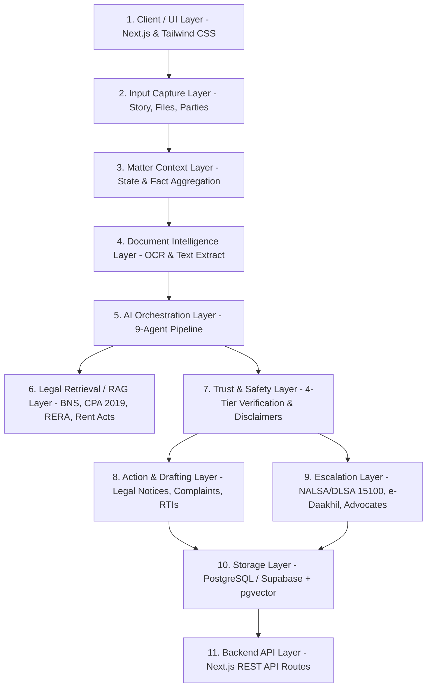

# ⚖️ NyaySaathi (न्यायसाथी)
### Matter-Based Legal Action Navigator for India

[](https://nextjs.org/)
[](https://www.typescriptlang.org/)
[](https://tailwindcss.com/)
[](https://www.postgresql.org/)
[](LICENSE)

> **NyaySaathi is not an AI legal chatbot.**  
> It is an actionable, matter-centric legal navigation system designed for Indian citizens, tenants, consumers, and small enterprises. It organizes disputes, extracts evidence, assesses limitation periods, generates formal Indian legal notices, and provides direct escalation pathways to **NALSA free legal aid**, **e-Daakhil**, and **RERA**.

---

## 🧭 The 5-Stage Navigator Loop

Unlike transient chatbots that lose context and produce hallucinated certainty, NyaySaathi operates on a structured loop:

```
┌─────────────┐    ┌───────────────┐    ┌──────────────┐    ┌─────────────┐    ┌──────────────┐
│ 1. CAPTURE  │ ─> │ 2. UNDERSTAND │ ─> │  3. ASSESS   │ ─> │   4. ACT    │ ─> │ 5. ESCALATE  │
└─────────────┘    └───────────────┘    └──────────────┘    └─────────────┘    └──────────────┘
  Story, Files,      Chronology, OCR,     Risks, Gaps,        Notices, RTIs,     DLSA/NALSA,
  Parties, Stake     Verified Facts       Limitation Clock    Complaints, Plan   e-Daakhil, Bar
```

---

## 🏛️ 11-Layer System Architecture



---

## 🤖 9 Internal Modular AI Agents

All AI logic is partitioned into modular, testable internal agents coordinated by a master orchestrator (`src/lib/agents/orchestrator.ts`):

1. **Intake Agent** (`intake-agent.ts`): Parses freeform narratives, normalizes party details, and identifies legal conflict classification.
2. **Document Intelligence Agent** (`doc-intel-agent.ts`): Simulates OCR text extraction, classifies lease agreements, invoices, and WhatsApp chats, and tags key clauses.
3. **Context & Timeline Agent** (`timeline-agent.ts`): Reconstructs a strict chronological milestone trail and spots missing documentary dates.
4. **Legal Retrieval Agent** (`retrieval-agent.ts`): Maps disputes to Indian statutory anchors (Bharatiya Nyaya Sanhita - BNS, Consumer Protection Act 2019, RERA Section 18, Model Tenancy Act, NI Act 138, Payment of Wages Act).
5. **Reasoning Agent** (`reasoning-agent.ts`): Synthesizes case strengths, evidentiary vulnerabilities, and anticipated counter-arguments.
6. **Risk Assessment Agent** (`risk-agent.ts`): Computes statutory limitation windows under the Indian Limitation Act 1963 and flags evidence gaps.
7. **Action Planner Agent** (`action-planner-agent.ts`): Structures a 3-phase checklist (*Immediate 0-48h*, *Short-Term 1-14d*, *Formal Escalation*).
8. **Drafting Agent** (`drafting-agent.ts`): Generates ready-to-send formal Indian Legal Demand Notices, e-Daakhil consumer complaint plaints, and 1-page Advocate Briefs.
9. **Safety Verification Agent** (`safety-agent.ts`): Enforces 4-tier output separation and injects statutory disclaimers.

---

## 🛡️ Trust & Safety: 4-Tier Classification

Every insight produced by NyaySaathi is explicitly categorized into one of four distinct tiers:

| Tier | Icon / Color | Definition | Indian Legal Example |
| :--- | :--- | :--- | :--- |
| **1. Verified Fact** | 🟢 Emerald | Direct statement grounded in uploaded agreements or verified transaction slips | *“₹75,000 security deposit paid via NEFT on 1 Feb 2025.”* |
| **2. Legal Meaning** | 🔵 Sky Blue | Plain-language explanation of statutory provisions and procedural rules | *“Under Indian tenancy law, ordinary wear and tear cannot be unilaterally deducted without GST bills.”* |
| **3. Possibility** | 🟡 Amber | Potential risk vectors, counter-arguments, and scenarios | *“Landlord may claim undocumented property damage or cite lack of joint move-out inspection.”* |
| **4. Counsel Required** | 🔴 Rose | Procedural steps requiring an enrolled advocate | *“Filing a formal vakalatnama or arguing in Court of Small Causes requires an enrolled Advocate.”* |

---

## 📂 Project Structure

```
nyaysaathi/
├── src/
│   ├── app/
│   │   ├── layout.tsx                  # Global layout with Navbar & Footer
│   │   ├── page.tsx                    # Landing page & live test fixtures
│   │   ├── globals.css                 # Warm, calm Indian legal theme tokens
│   │   ├── matters/
│   │   │   ├── page.tsx                # Matter listing & category filtration
│   │   │   ├── new/page.tsx            # 4-Step guided matter capture wizard
│   │   │   └── [id]/page.tsx           # Full Matter Command Center
│   │   └── api/
│   │       └── matters/
│   │           ├── route.ts            # GET (list), POST (create)
│   │           └── [id]/
│   │               ├── route.ts        # GET, PATCH, DELETE
│   │               └── analyze/route.ts# Trigger 9-Agent Pipeline re-analysis
│   ├── components/
│   │   ├── layout/
│   │   │   ├── Navbar.tsx              # Top bar with NALSA 15100 helpline badge
│   │   │   └── Footer.tsx              # Trust statements & official portal links
│   │   └── matter/
│   │       ├── MatterHeader.tsx        # Title, metadata, and re-analysis trigger
│   │       ├── TrustSafetyCard.tsx     # 4-tier transparent classification view
│   │       ├── TimelineView.tsx        # Chronological trail with evidence tags
│   │       ├── RiskAlertBox.tsx        # Risk vectors & missing info questionnaire
│   │       ├── ActionChecklist.tsx     # 3-phase checkable roadmap
│   │       ├── EvidenceUploader.tsx    # Evidence locker & OCR intelligence
│   │       ├── DraftStudio.tsx         # Notice generator with copy/download
│   │       ├── LawyerBriefCard.tsx     # 1-page condensed Advocate Case Brief
│   │       ├── EscalationPathwayCard.tsx# Portals (NALSA, e-Daakhil, RERA, 1930)
│   │       └── FollowUpQA.tsx          # Guardrailed matter clarification Q&A
│   ├── lib/
│   │   ├── agents/                     # 9 modular agents + orchestrator
│   │   ├── db/
│   │   │   ├── schema.sql              # Production PostgreSQL/Supabase schema
│   │   │   ├── mock-db.ts              # In-memory store with full CRUD
│   │   │   └── seed-data.ts            # Authentic Indian legal fixtures
│   │   ├── legal/
│   │   │   ├── statutes.ts             # Indian statutory provisions dictionary
│   │   │   └── indian-jurisdictions.ts # DLSA, e-Daakhil, Cybercrime directory
│   │   └── utils.ts                    # Formatting helpers (INR currency, dates)
│   └── types/
│       └── matter.ts                   # Core TypeScript domain models
├── package.json
├── tsconfig.json
└── tailwind.config.ts
```

---

## ⚡ Getting Started

### Prerequisites
- Node.js 18.18+ or 20+
- npm, pnpm, or yarn

### 1. Clone the repository
```bash
git clone https://github.com/di0206-innovator/nyaysaathi.git
cd nyaysaathi
```

### 2. Install dependencies
```bash
npm install
```

### 3. Run the development server
```bash
npm run dev
```
Open [http://localhost:3000](http://localhost:3000) in your browser.

### 4. Build for Production
```bash
npm run build
npm run start
```

---

## 🗄️ Database & Vector RAG Schema

NyaySaathi includes a complete production-ready PostgreSQL / Supabase schema in [`src/lib/db/schema.sql`](src/lib/db/schema.sql):
- **Matters Table**: Core parent table tracking status, plain language summary, and claim amounts.
- **Parties & Documents**: Structured roles, evidence classifications, and OCR text.
- **pgvector Integration**: `vector(1536)` columns on documents and statutory knowledge base for semantic retrieval.
- **Row Level Security (RLS)**: Enforces tenant isolation per user.

---

## ⚖️ Important Legal Disclaimer

*NyaySaathi is an informational navigation and case preparation system designed to assist citizens in structuring facts and understanding their options. It does not provide formal legal advice, practice law, or create an advocate-client relationship. For court representation, affidavit attestation, or complex litigation, please consult an enrolled Advocate or visit your nearest District Legal Services Authority (DLSA) center (National Legal Aid Helpline: 15100).*

---

## 📄 License

Distributed under the MIT License. See `LICENSE` for more information.
