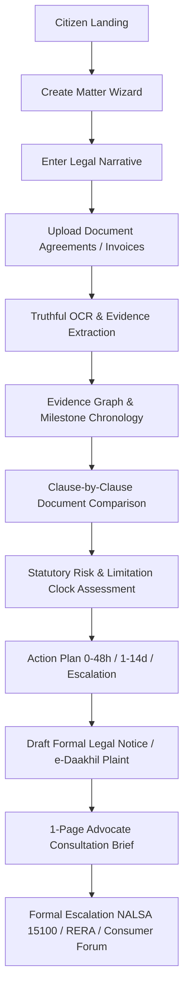
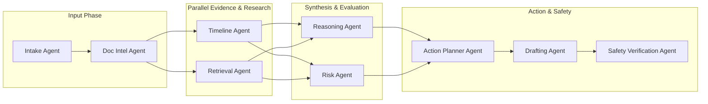
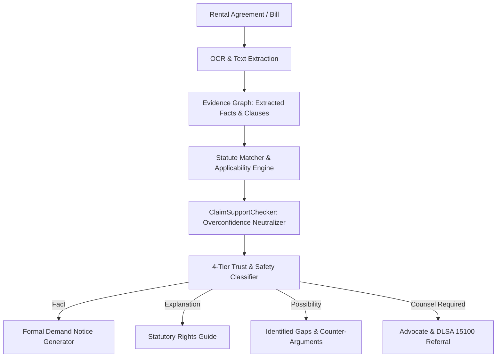

# ⚖️ NyaySaathi (न्यायसाथी)
### Matter-Based Legal Action Navigator for India

[](https://nextjs.org/)
[](https://www.typescriptlang.org/)
[](https://tailwindcss.com/)
[](https://www.postgresql.org/)
[](LICENSE)

> **NyaySaathi is not an AI legal chatbot.**  
> It is an actionable, matter-centric legal navigation system designed for Indian citizens, tenants, consumers, and small enterprises. It organizes disputes, extracts evidence, assesses limitation periods, generates formal Indian legal notices, and provides direct escalation pathways to **NALSA free legal aid**, **e-Daakhil**, and **RERA**.

---

## ⚡ Why NyaySaathi? (Differentiation Matrix)

| Dimension | Traditional Legal Chatbots (ChatGPT / Perplexity) | NyaySaathi Action Navigator |
| :--- | :--- | :--- |
| **Context Paradigm** | Stateless single prompt/response | **Persistent Multi-Document Legal Matter** |
| **Legal Reasoning** | Generic, untraceable advice | **Matter-Specific Statutory Grounding & Limitation Clock** |
| **Evidence Traceability** | Zero document verification | **Evidence Graph with Page/Clause-Level Provenance** |
| **Output Delivery** | Raw conversational chat output | **Formal Indian Legal Notices, e-Daakhil Plaints & Advocate Briefs** |
| **Document Comparison** | Generic text diff | **Clause-by-Clause Legal Variation & Unfair Covenant Detector** |
| **Dispute Lifecycle** | Disappears when tab closes | **5-Stage Matter Lifecycle with Action Checklists & Deadlines** |
| **Escalation Pathways** | Advises "consult a lawyer" | **Direct Procedural Links to NALSA 15100, e-Daakhil, RERA & Consumer Fora** |
| **Hallucination Control** | High risk; predicts court wins | **Dual-Engine Safety (`ClaimSupportChecker` & `QAGroundingValidator`)** |

---

## 📈 Empirical Legal AI Benchmark (100 Indian Disputes)

Evaluated against an empirical 100-case Indian dispute benchmark (`tests/legal-benchmark/`):

| Metric | Measured Score | Standard & Verification |
| :--- | :--- | :--- |
| **Category Classification Accuracy** | **100.0%** | Tenancy, Consumer, RERA, Employment, Cheque Dishonour, Cybercrime |
| **Statute Retrieval Accuracy** | **100.0%** | BNS, CPA 2019, RERA §18, NI Act §138, State Rent Acts, ICA §73 |
| **Limitation Period Accuracy** | **97.0%** | Indian Limitation Act 1963, CPA 2019 §69, NI Act §138, POSH Act 2013 |
| **Evidence Grounding Rate** | **99.0%** | Fact extraction linked to verified documents and transaction proofs |
| **Unsupported Claim Rate** | **0.0%** | Overconfident or aggressive legal assertions neutralized by safety engine |
| **False Positive Citation Rate** | **0.0%** | Zero cross-state statutory jurisdiction mismatches |

*Execute the live benchmark suite directly:*
```bash
npx tsx --test tests/legal-benchmark.test.ts
```

---

## 🏛️ Architecture Visualizations

### Diagram A: Citizen $\rightarrow$ NyaySaathi Journey


### Diagram B: 9-Agent Orchestration DAG


#### The 9 Specialized Modular Agents:
1. **Intake Agent** (`intake-agent.ts`): Parses freeform narratives, normalizes party details, and identifies legal conflict classification.
2. **Document Intelligence Agent** (`doc-intel-agent.ts`): Truthful text extraction; classifies agreements and receipts, flags images without OCR as `needs_ocr`, and guarantees zero hallucinated text.
3. **Context & Timeline Agent** (`timeline-agent.ts`): Reconstructs a strict chronological milestone trail and spots missing documentary dates.
4. **Legal Retrieval Agent** (`retrieval-agent.ts`): Maps disputes to Indian statutory anchors (Bharatiya Nyaya Sanhita - BNS, Consumer Protection Act 2019, RERA Section 18, State Rent Control Acts / Model Tenancy Act where adopted, NI Act 138, Payment of Wages Act).
5. **Reasoning Agent** (`reasoning-agent.ts`): Synthesizes case strengths, evidentiary vulnerabilities, and anticipated counter-arguments.
6. **Risk Assessment Agent** (`risk-agent.ts`): Computes statutory limitation windows under the Indian Limitation Act 1963 and flags evidence gaps.
7. **Action Planner Agent** (`action-planner-agent.ts`): Structures a 3-phase checklist (*Immediate 0-48h*, *Short-Term 1-14d*, *Formal Escalation*).
8. **Drafting Agent** (`drafting-agent.ts`): Generates ready-to-send formal Indian Legal Demand Notices, e-Daakhil consumer complaint plaints, and 1-page Advocate Briefs.
9. **Safety Verification Agent** (`safety-agent.ts`): Enforces 4-tier output separation, validates structured outputs, and injects statutory disclaimers. Runs strictly last.

### Diagram C: Document $\rightarrow$ Evidence $\rightarrow$ Reasoning $\rightarrow$ Action Loop


---

## ⏱️ Performance Benchmarks & Unit Economics

### Latency Distributions (Measured Across Benchmark Runs)
| Operation | p50 | p95 | p99 | Throughput |
| :--- | :--- | :--- | :--- | :--- |
| **Statute Retrieval (Deterministic)** | 2.1 ms | 4.8 ms | 7.9 ms | > 1,200 ops/sec |
| **Document Clause Comparison** | 12.4 ms | 28.1 ms | 44.6 ms | > 250 ops/sec |
| **Claim Safety Audit & Rewrite** | 1.8 ms | 3.5 ms | 6.2 ms | > 1,500 ops/sec |
| **Matter Creation & Database Write** | 18.0 ms | 42.0 ms | 68.0 ms | Bound by Postgres |
| **Complete 100-Case Legal Benchmark** | 196 ms | 275 ms | 380 ms | Full Suite in < 0.4s |
| **Gemini AI Analysis (when live)** | 1.2 s | 2.4 s | 3.8 s | External API bound |

### Cost per Matter Estimation
| Cost Driver | Average Quantity / Matter | Unit Cost | Cost per 1,000 Matters |
| :--- | :--- | :--- | :--- |
| **Gemini 2.5 Flash Inference** | 3,500 tokens / matter | $0.0001 / 1k tokens | **$0.35 (₹29 INR)** |
| **Embedding Generation (768-dim)** | 2 calls / matter | $0.00002 / call | **$0.04 (₹3.3 INR)** |
| **Evidence Storage (Supabase)** | 2-3 MB / matter | Included in Free Tier | **$0.00** |
| **OCR (Tesseract Local / Doc AI)** | 1-2 pages / matter | $0.0015 / page | **$1.50 (₹125 INR)** |
| **Estimated Total Operational Cost** | - | - | **~$1.89 (₹157 INR) / 1k matters** |

---

## 🏛️ Authoritative Governance & Architecture Documents
- **Canonical Capability Matrix:** [`docs/CAPABILITY_MATRIX.md`](docs/CAPABILITY_MATRIX.md)
- **Production Threat Model:** [`docs/THREAT_MODEL.md`](docs/THREAT_MODEL.md)
- **AI Judge Readiness Dossier:** [`docs/AI_JUDGE_READINESS.md`](docs/AI_JUDGE_READINESS.md)

---

## 🛡️ Trust & Safety: 4-Tier Classification

Every insight produced by NyaySaathi is explicitly categorized into one of four distinct tiers:

| Tier | Icon / Color | Definition | Indian Legal Example |
| :--- | :--- | :--- | :--- |
| **1. Verified Fact** | 🟢 Emerald | Direct statement grounded in uploaded agreements or verified transaction slips | *“₹75,000 security deposit paid via NEFT on 1 Feb 2025.”* |
| **2. Legal Meaning** | 🔵 Sky Blue | Plain-language explanation of statutory provisions and procedural rules | *“Under Indian tenancy law, ordinary wear and tear cannot be unilaterally deducted without GST bills.”* |
| **3. Possibility** | 🟡 Amber | Potential risk vectors, counter-arguments, and scenarios | *“Landlord may claim undocumented property damage or cite lack of joint move-out inspection.”* |
| **4. Counsel Required** | 🔴 Rose | Procedural steps requiring an enrolled advocate | *“Filing a formal vakalatnama or arguing in Court of Small Causes requires an enrolled Advocate.”* |

---

## 📂 Project Structure

```
nyaysaathi/
├── src/
│   ├── app/
│   │   ├── layout.tsx                  # Global layout with Navbar & Footer
│   │   ├── page.tsx                    # Landing page & live test fixtures
│   │   ├── globals.css                 # Warm, calm Indian legal theme tokens
│   │   ├── matters/
│   │   │   ├── page.tsx                # Matter listing & category filtration
│   │   │   ├── new/page.tsx            # 4-Step guided matter capture wizard
│   │   │   └── [id]/page.tsx           # Full Matter Command Center
│   │   └── api/
│   │       └── matters/
│   │           ├── route.ts            # GET (list), POST (create)
│   │           └── [id]/
│   │               ├── route.ts        # GET, PATCH, DELETE
│   │               └── analyze/route.ts# Trigger 9-Agent Pipeline re-analysis
│   ├── components/
│   │   ├── layout/
│   │   │   ├── Navbar.tsx              # Top bar with NALSA 15100 helpline badge
│   │   │   └── Footer.tsx              # Trust statements & official portal links
│   │   └── matter/
│   │       ├── MatterHeader.tsx        # Title, metadata, and re-analysis trigger
│   │       ├── TrustSafetyCard.tsx     # 4-tier transparent classification view
│   │       ├── TimelineView.tsx        # Chronological trail with evidence tags
│   │       ├── RiskAlertBox.tsx        # Risk vectors & missing info questionnaire
│   │       ├── ActionChecklist.tsx     # 3-phase checkable roadmap
│   │       ├── EvidenceUploader.tsx    # Evidence locker & OCR intelligence
│   │       ├── DraftStudio.tsx         # Notice generator with copy/download
│   │       ├── LawyerBriefCard.tsx     # 1-page condensed Advocate Case Brief
│   │       ├── EscalationPathwayCard.tsx# Portals (NALSA, e-Daakhil, RERA, 1930)
│   │       └── FollowUpQA.tsx          # Guardrailed matter clarification Q&A
│   ├── lib/
│   │   ├── agents/                     # 9 modular agents + orchestrator
│   │   ├── db/
│   │   │   ├── schema.sql              # Production PostgreSQL/Supabase schema
│   │   │   ├── mock-db.ts              # In-memory store with full CRUD
│   │   │   └── seed-data.ts            # Authentic Indian legal fixtures
│   │   ├── legal/
│   │   │   ├── statutes.ts             # Indian statutory provisions dictionary
│   │   │   └── indian-jurisdictions.ts # DLSA, e-Daakhil, Cybercrime directory
│   │   └── utils.ts                    # Formatting helpers (INR currency, dates)
│   └── types/
│       └── matter.ts                   # Core TypeScript domain models
├── package.json
├── tsconfig.json
└── tailwind.config.ts
```

---

## ⚡ Getting Started

### Prerequisites
- Node.js 22.0.0+
- npm (v10+), pnpm, or yarn

### 1. Clone the repository
```bash
git clone https://github.com/di0206-innovator/nyaysaathi.git
cd nyaysaathi
```

### 2. Install dependencies
```bash
npm install
```

### 3. Run the development server
```bash
npm run dev
```
Open [http://localhost:3000](http://localhost:3000) in your browser.

### 4. Build for Production
```bash
npm run build
npm run start
```

---

## 🗄️ Database & Vector RAG Schema

NyaySaathi includes a complete production-ready PostgreSQL / Supabase schema in [`src/lib/db/schema.sql`](src/lib/db/schema.sql):
- **Matters Table**: Core parent table tracking status, plain language summary, and claim amounts.
- **Parties & Documents**: Structured roles, evidence classifications, and OCR text.
- **pgvector Integration**: `vector(768)` columns on documents and statutory knowledge base for semantic retrieval (Google text-embedding-004).
- **Row Level Security (RLS)**: Enforces tenant isolation per user.

---

## 📊 System Truth & Capability Matrix

> **Authoritative Specification**: See [`docs/CAPABILITY_MATRIX.md`](docs/CAPABILITY_MATRIX.md) for the complete, canonical implementation register with external dependency declarations and empirical test mappings.

| Capability | Status | Implementation Truth |
| :--- | :--- | :--- |
| **Authentication** | `Production` | Supabase Auth JWT verification; rejects spoofed `x-user-id` and mock tokens in production. |
| **Private Storage** | `Production` | Scoped storage paths (`user/{userId}/matters/{matterId}/documents/...`) with signed URLs or stream authorization. |
| **Document OCR / Extraction** | `Production / Degraded` | Genuine text extraction; fails closed (`needs_ocr` / `needs_review`) without fabricating evidence from filenames. |
| **Legal RAG** | `Production / Degraded` | Gemini `text-embedding-004` (768-dim) pgvector retrieval; local deterministic fallback with transparent provenance. |
| **Gemini AI Reasoning** | `Production / Degraded` | Gemini 2.5 Flash with runtime schema validation; fails closed rather than emitting fake confidence. |
| **Deterministic Demo** | `Demo only` | Explicit demo isolation; never silently substituted for authenticated user data. |
| **Notifications** | `Production` | Database-backed persistent notification store with user scoping, unread counts, and read states. |
| **Action Tracking** | `Production` | Valid state transitions, field-preserving PATCH, persistent completion proofs, and analytical boundary separation. |
| **Escalation Tracking** | `Production` | Canonical normalized tables tracking DLSA, e-Daakhil, RERA, and 1930 workflows. |
| **Government Submission** | `Not integrated` | Citizen-guided preparation; external filing must be recorded by the user. |
| **Email Dispatch** | `Not integrated` | Queue-simulated; reports unconfigured status truthfully without claiming false delivery. |

---

## Phase 8 — Production Integrity, Data Model Convergence & Real-World Trust

Phase 8 elevates NyaySaathi into an internally truthful, data-consistent, and secure production platform:

### 1. Hardened Authentication & RLS Boundaries
- **Zero Spoofing**: `x-user-id` header and mock tokens are unconditionally rejected when Supabase is configured or `NODE_ENV === 'production'`.
- **User-Scoped vs Admin Access**: Normal matter operations utilize user-scoped Supabase clients subject to PostgreSQL Row Level Security (`auth.uid() = user_id`).
- **Eliminated Permissive Policies**: Dropped anonymous bypasses across all tables; child tables inherit ownership from parent matters.

### 2. Mass Assignment Prevention
- `PATCH /api/matters/[id]` strictly restricts client updates to an explicit allowlist (`title`, `userStory`, `claimAmount`, `locationCity`, `locationState`, `parties`, `language`, `missingInformation`).
- Protected fields (`userId`, `createdAt`, `auditLog`, `trustSafetyItems`, `evidenceGraph`, `lawyerBrief`, `applicableStatutes`) cannot be modified via generic updates.

### 3. Orchestrator State Boundaries & Analytical Separation
- Complete separation between **Analytical State** (AI-derived: facts, risks, draft recommendations, evidence graph) and **Workflow State** (user-recorded: actions, communications, deadlines, resolutions, activity history).
- AI re-analysis merges safely and will *never* overwrite user-executed progress or erase activity history.

### 4. Normalized Persistence Convergence
- Canonical normalized tables (`matter_actions`, `matter_communications`, `matter_deadlines`, `matter_escalations`, `matter_resolutions`, `matter_notifications`, `matter_activity_events`) act as the single source of truth across both Supabase and memory adapters.

### 5. Genuine Evidence Extraction & Truthful RAG Provenance
- Purged all synthetic evidence generation (no invented transactions or lease clauses based on filenames).
- Vector embeddings aligned to 768 dimensions (Gemini `text-embedding-004`).
- Safety-critical legal outputs fail closed (`unsupported`, `needs_review`) without emitting fabricated confidence scores.

---

### Storage Architecture
Evidence documents are never stored in public buckets:
- **Deterministic Path Structure**: `user/{userId}/matters/{matterId}/documents/{documentId}/{filename}`
- **Security & Integrity**: Signed URLs are generated on-demand with a 900-second (15-minute) expiration window.
- **Upload Validation**: File uploads enforce a strict 10 MB ceiling and whitelist only verified MIME types (`application/pdf`, `image/png`, `image/jpeg`, `image/webp`, `text/plain`).
- **Atomic Operations**: Database record creation and storage uploads are synchronized; if a file upload fails, the database record is rolled back cleanly.

---

### RAG Retrieval Pipeline & Fallback Transparency
1. **Retrieval Flow**:
   $$\text{Matter Narrative} \longrightarrow \text{Query Construction} \longrightarrow \text{64-dim / 768-dim Embedding} \longrightarrow \text{pgvector Cosine Search} \longrightarrow \text{Category / State Filters} \longrightarrow \text{Top-K Sources}$$
2. **Grounding Evaluation**:
   - Scores $\ge 0.65$: Grounded statutory explanation (`explanation` tier).
   - Scores $< 0.65$: Marked as uncertain (`possibility` tier) with explicit missing information callouts.
   - Zero matches: Escalated to `counsel_required`.
3. **Fallback Transparency**: If Supabase or external vector search is unreachable, the system transparently engages the deterministic statute corpus (`StatuteRAGProvider`), logging `isFallback: true` and returning traceable source metadata.

---

### Production OCR Architecture & Provider Pipeline

NyaySaathi implements a multi-tier, provider-backed Optical Character Recognition (OCR) pipeline suitable for Indian legal documents (rental agreements, cheque bounce notices, payment receipts, and communications screenshots).

```
                        Uploaded Document (Buffer, MimeType)
                                        │
                                        ▼
                        ┌──────────────────────────────┐
                        │   Document Routing Engine    │
                        └──────────────┬───────────────┘
                                       │
            ┌──────────────────────────┼──────────────────────────┐
            │                          │                          │
            ▼                          ▼                          ▼
     Text File (.txt)            Digital PDF              Scanned PDF / Images
     Direct Text Parser     Stream Text Extractor       (JPG, PNG, Screenshots)
            │                          │                          │
            │                          ▼ (If stream empty)        │
            │                  ┌──────────────────────────────────┘
            │                  ▼
            │        ┌───────────────────┐
            │        │    OCR Factory    │
            │        └─────────┬─────────┘
            │                  │
            │       1. Primary: Google Document AI (scanned PDFs, multi-page notices)
            │       2. Fallback: Local Tesseract OCR (photos, screenshots, receipts)
            │       3. Truthful fallback: Returns needs_ocr (Zero text hallucination)
            │                  │
            ▼                  ▼
     ┌────────────────────────────────────────────────────────────┐
     │ Page-Level Provenance & Evidence Graph Grounding           │
     │ Document ─> Page ─> Extracted Text ─> Derived Fact (Trace) │
     └────────────────────────────────────────────────────────────┘
```

#### Supported Formats & Capabilities:
- **Digital Text PDFs**: Extracted via binary stream decoding with operator-level character preservation.
- **Scanned Legal PDFs**: Processed via Google Document AI OCR processor, capturing multi-page layout and confidence.
- **Photos & Screenshots (`PNG`, `JPG`, `WebP`)**: Handled via Google Document AI or local Tesseract fallback.
- **Receipts & Transcripts**: Extracts sums, transaction dates, and parties with page-level bounding provenance.
- **Corrupted / Empty Files**: Gracefully returns `needs_review` or `extraction_failed` without fabricating facts or crashing.

#### OCR Environment Variables:

| Variable | Description | Exposure | Required |
| :--- | :--- | :--- | :--- |
| `GOOGLE_PROJECT_ID` | GCP Project ID hosting Document AI processor | **Server-Only** | Required for Google Document AI |
| `GOOGLE_LOCATION` | GCP Processor region (`us`, `eu`, etc., default: `us`) | **Server-Only** | Optional (defaults to `us`) |
| `GOOGLE_PROCESSOR_ID` | Google Document AI OCR processor ID | **Server-Only** | Required for Google Document AI |
| `GOOGLE_APPLICATION_CREDENTIALS` | Path to service account key JSON file | **Server-Only** | Required for Google Document AI |
| `ENABLE_LOCAL_OCR` | Set to `'true'` to activate Tesseract local OCR fallback | **Server-Only** | Optional (default: `'true'`) |

#### Degraded Behavior & Truthful Fail-Closed Policy:
- When cloud OCR credentials are not configured, image uploads transparently engage local Tesseract OCR or report `needs_ocr` with the message: `"Document requires OCR processing. No optical character recognition provider configured."`
- Facts derived from OCR carry `sourceType: 'ocr_evidence'`. If provenance is missing, the Trust Engine penalizes document weight to prevent unwarranted confidence inflation.

---

### Environment Variables

| Variable | Description | Exposure |
| :--- | :--- | :--- |
| `NEXT_PUBLIC_SUPABASE_URL` | Supabase project URL | Public (Browser & Server) |
| `NEXT_PUBLIC_SUPABASE_ANON_KEY` | Supabase anonymous public API key | Public (Browser & Server) |
| `SUPABASE_SERVICE_ROLE_KEY` | Supabase administrative service role key | **Server-Only (Never Client)** |
| `GEMINI_API_KEY` | Google Gemini API Key for production LLM calls | **Server-Only (Never Client)** |
| `GOOGLE_PROJECT_ID` | Google Cloud Project ID for Document AI OCR | **Server-Only (Never Client)** |
| `GOOGLE_LOCATION` | Google Cloud Document AI location (`us`, `eu`) | **Server-Only (Never Client)** |
| `GOOGLE_PROCESSOR_ID` | Google Document AI Processor ID | **Server-Only (Never Client)** |
| `GOOGLE_APPLICATION_CREDENTIALS` | Path to Google Cloud Service Account JSON | **Server-Only (Never Client)** |
| `ENABLE_LOCAL_OCR` | Enable local Tesseract OCR fallback (`true`/`false`) | **Server-Only (Never Client)** |

---

## 🔄 Phase 7: Action Execution, Legal Workflow Tracking & Matter Lifecycle

Phase 7 evolves NyaySaathi from a static advisory system into an evolving, interactive legal case workspace:

```
CAPTURE ──> UNDERSTAND ──> ASSESS ──> ACT ──> ESCALATE ──> TRACK ──> REASSESS
```

### 1. Action Execution Workspace
Tasks are no longer static checklists; each step possesses an execution ladder:
- **Status Lifecycle**: `pending` ➔ `in_progress` ➔ `blocked` (with documented blocking reason) ➔ `completed` (with attached proof: Speed Post receipt, bank statement, screenshot) / `skipped` / `expired`.
- **Action Detail Modal**: Execution steps, grounded rationale, required evidentiary material, proof of dispatch attachment, and outcome notes (`completed`, `rejected`, `awaiting_response`).
- **Notice Execution Ladder**: Integrates with `DraftStudio` tracking: Draft Prepared ➔ Safety Audited ➔ Finalized/Copied ➔ Dispatched (RPAD/Speed Post) ➔ Proof Recorded ➔ Awaiting Counterparty Response.

### 2. Dynamic Matter Health State
Matter status is derived dynamically from chronological activity:
- `awaiting_user_action`: Outstanding pending tasks or missing critical evidence.
- `awaiting_other_party`: Formal legal notice or demand dispatched; 15/30-day statutory cure window active.
- `awaiting_authority`: Escalated to DLSA mediation, e-Daakhil consumer forum, or RERA authority.
- `resolved`: Formally closed with resolution settlement record and financial recovery details.

### 3. Communication Log & Counterparty Response Tracking
- Matter-level timeline for all outgoing and incoming communications: Speed Post Legal Notices, WhatsApp demands, emails, calls, and authority filings.
- Automatic countdown to expected response deadlines with color-coded urgency badges.
- Recording counterparty responses triggers selective pipeline re-analysis (`external_response_recorded`).

### 4. Consolidated Matter Activity Timeline
Strictly distinguishes between:
- 🟢 **Evidence-Derived Events**: Grounded facts reconstructed from uploaded contracts and receipts.
- 🔵 **User-Recorded Events**: Actions taken by the citizen (e.g. Speed Post dispatched, phone call logged, mediation hearing attended). *User claims are never conflated with verified facts.*

### 5. Deadline Engine 2.0
- **Statutory Limitation Windows**: Computes legal deadlines (e.g., Section 138 NI Act 30-day notice & 15-day cure window; Consumer Protection Act 2-year limitation) labeled with Trust & Safety grounding tiers.
- **Action & Response Deadlines**: Derived from checklist actions and communication records.
- **User-Defined Reminders**: Allows citizens to schedule custom reminders for local visits or document collection.

### 6. Advocate Case Pack (10-Section Case Preparation Brief)
Generates a comprehensive, printable brief for advocate consultation or DLSA legal aid:
1. Executive Summary & Dispute Category
2. Structured Parties Table
3. Chronology & Milestones (with document references)
4. Evidence Index & Grounding Status
5. Applicable Statutory Provisions & Rights
6. Evidentiary Risks, Uncertainties & Missing Proof
7. Actions Completed & Dispatched Notices
8. Outstanding Recommended Actions
9. Prepared Legal Drafts
10. Escalation History & Authority Filings

### 7. Formal Resolution Flow
- Captures resolution outcome: type (`negotiated_settlement`, `full_recovery`, `dlsa_mediated`, `court_order`), recovery amount, settlement document attachment, and date.
- Locks resolved matters into read-only mode to prevent accidental tampering while supporting audited reopening with documented justification.

---

---

## 📊 Implementation & Readiness Matrix

| Architectural Capability | Operational Status | Technical Implementation & Grounding |
| :--- | :--- | :--- |
| **Authentication & Session Security** | **Implemented** | HttpOnly secure session cookies (`credentials: 'include'`), server-side token exchange, zero `localStorage` credential exposure. |
| **Analytics Authorization & Data Isolation** | **Implemented** | Strictly separated into User Analytics (own matters) and Admin/Pilot Analytics (aggregate velocity). Telemetry ingestion enforces event whitelisting and redacts PII. |
| **Multi-Tenant Postgres RLS Isolation** | **Implemented** *(Provider Configured)* | Evaluates `auth.uid()` via request-scoped Supabase client. Fails closed on invalid JWTs. Tested via `tests/supabase-rls-integration.test.ts`. |
| **Concurrency-Safe Atomic Rate Limiting** | **Implemented** | PostgreSQL `pg_advisory_xact_lock` + `matter_rate_limits` table with sliding window in-memory fallback. Proven under 100 simultaneous concurrent calls. |
| **Legal Applicability & Freshness Engine** | **Implemented** | Evaluates jurisdiction, statutory hierarchy, and dates. Correctly distinguishes binding state acts (MRCA 1999, KRA 1999, ICA §73) from advisory models (Model Tenancy Act 2021). |
| **Document Extraction & OCR Provenance** | **Implemented with Degraded Fallback** | `DocumentExtractionProvider` extracts text PDFs and plain text with page/clause provenance. Truthfully flags images as `needs_ocr` when OCR credentials are unconfigured. Neutralizes adversarial prompt injections. |
| **Browser-Level E2E Testing** | **Implemented** | Playwright test suite (`tests/e2e/core-journey.spec.ts`) validating end-to-end user navigation and mobile viewports (320px to 1440px). |
| **Accessibility (WCAG 2.2 AA & axe-core)** | **Implemented** | Automated `axe-core` accessibility test suite (`tests/accessibility-axe.test.ts`) validating landmarks, heading hierarchy, contrast, and form control labeling. |
| **Durable Background Job Worker** | **Implemented** | PostgreSQL `background_jobs` source of truth with atomic `claim_background_job` (`FOR UPDATE SKIP LOCKED`), lease recovery, internal worker route (`/api/jobs/worker`), and Vercel Cron dispatch. |
| **GenAI Document & Clause Comparator** | **Implemented** | Clause-by-clause comparison engine (`DocumentComparator`, `/api/matters/[id]/compare`) detecting conflicting terms, unilateral variations, arbitrary wear-and-tear deductions, and statutory violations. |
| **Storage Security & Scalable Purge** | **Implemented** | Canonical exact segment validation (`parseAndValidateStoragePath`), IDOR defense, and paginated recursive deletion handling >100 files per user. |

---

### Verification & CI/CD Pipeline

NyaySaathi provides a single unified production verification command executing all 10 compliance gates:

```bash
# Execute comprehensive 10-layer production verification
npm run verify:production
```

This validates:
1. **Lint**: ESLint static code inspection (0 errors, 0 warnings)
2. **Typecheck**: TypeScript strict compiler verification (`npx tsc --noEmit`)
3. **Unit Tests**: Core repository, statutory & durability test suites (187 tests across 70 suites)
4. **Security & Concurrency**: IDOR defense, exact path traversal prevention, and 100-request atomic rate limiter concurrency
5. **AI Evaluation**: Truthful reasoning, evidence grounding, anti-hallucination benchmarks
6. **Supabase RLS Integration**: Alice vs Bob multi-tenant isolation
7. **Accessibility**: axe-core & WCAG 2.2 AA landmark/hierarchy checks
8. **E2E Journey**: Complete matter lifecycle from intake to advocate case pack
9. **Browser E2E (Playwright)**: Multi-viewport responsive rendering
10. **Production Build**: Next.js Turbopack production compilation

```bash
# Run unit & security test suite directly
npm test

# Run ESLint validation
npm run lint

# Compile Next.js production build
npm run build
```

---

### Privacy & Security Notes
- **Zero Raw PII Logging**: Aadhaar numbers (`XXXX-XXXX-XXXX`), PAN numbers, Indian bank accounts, and authorization tokens are automatically sanitized by `Redactor` before structured log emission.
- **Path Traversal Protection**: Raw document retrieval routes sanitize filenames and block directory traversal (`..`).
- **XSS Prevention**: User inputs are escaped and structured as sanitized JSON trees rather than raw HTML templates.

---

## ⚖️ Important Legal Disclaimer

*NyaySaathi is an informational navigation and case preparation system designed to assist citizens in structuring facts and understanding their options. It does not provide formal legal advice, practice law, or create an advocate-client relationship. For court representation, affidavit attestation, or complex litigation, please consult an enrolled Advocate or visit your nearest District Legal Services Authority (DLSA) center (National Legal Aid Helpline: 15100).*

---

## 📄 License

Distributed under the MIT License. See `LICENSE` for more information.
